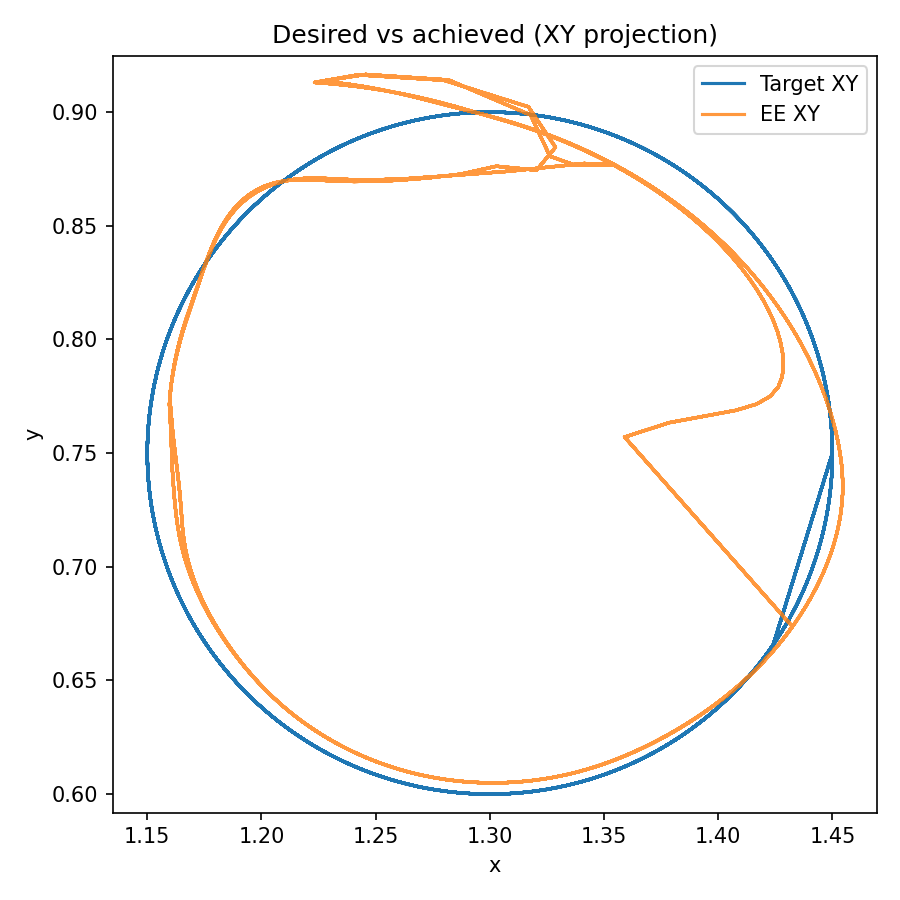
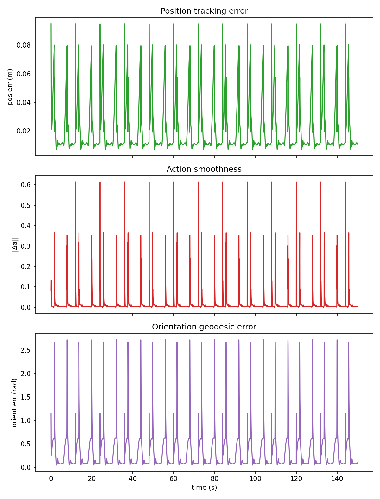

# Trajectory Tracking with PPO on Fetch Reach

This project implements Proximal Policy Optimization (PPO) for trajectory tracking on the FetchReachDense-v4 environment from Gymnasium Robotics. The focus is on quantitative evaluation, reward shaping, and sim-to-real robustness through observation noise, action noise, and action delay.

## Overview

The end-effector must follow a time-varying target trajectory \(p^*(t) \in \mathbb{R}^3\) while the simulator provides dense observations and torque-limited actions. The environment wrapper overrides the goal each step and defines a custom reward that emphasizes tracking accuracy and control smoothness.

## Key Contributions

- **Custom Reward Design**: Multi-component reward combining tracking accuracy, action smoothness, velocity penalties, and orientation tracking
- **Sim-to-Real Robustness**: Configurable observation noise, action noise, and action delay for real-world deployment preparation
- **Curriculum Learning**: Progressive training with increasing trajectory speed, noise levels, and action delay
- **Quantitative Evaluation**: Comprehensive metrics including RMSE, smoothness, and orientation error with cross-condition comparisons
- **Orientation Tracking**: End-effector orientation control via mocap quaternion override (not natively supported in FetchReach)

## System Architecture

The system consists of:
- **Environment Wrapper** (`envs/tracking_env.py`): Wraps FetchReachDense-v4, implements moving goal, custom reward, noise injection, and action delay
- **Trajectory Generator** (`utils/trajectories/`): Implements circle, figure-eight, and spline trajectories
- **Training Pipeline** (`train/train_ppo.py`): Config-driven PPO training with curriculum learning and TensorBoard logging
- **Evaluation Suite** (`scripts/eval_policy.py`): Policy rollout with metrics, plots, and video generation

## Installation

```bash
pip install -r requirements.txt
```

## Training

Train with the default configuration:

```bash
python train/train_ppo.py --config experiments/default.yaml
```

For the full training preset with orientation tracking, curriculum learning, and robustness features:

```bash
python train/train_ppo.py --config experiments/m4_orient.yaml --skip-check-env
```

### Training Features

- **Curriculum Learning**: Progressive difficulty with trajectory speed, noise, and delay stages
- **TensorBoard Logging**: Monitor training progress with `tensorboard --logdir ppo_tracking_tensorboard`
- **Device Selection**: Supports MPS (Apple Silicon), CUDA, and CPU
- **Vectorized Environments**: Configure `train.n_envs` for parallel rollouts
- **Long Episodes**: Set `env.max_episode_steps` for longer evaluation episodes

## Evaluation

Evaluate a trained policy:

```bash
python scripts/eval_policy.py --model ppo_m4_orient.zip --episodes 5 --save-dir outputs/final_eval
```

### Evaluation Metrics

- **Primary Metric**: RMSE of end-effector to target position
- **Secondary Metrics**: Mean action smoothness \(\|\Delta a\|\), joint velocity norms
- **Orientation Error**: Geodesic orientation error (radians) when orientation tracking is enabled
- **Robustness**: Compare RMSE with/without observation noise, action noise, and delay

### Evaluation Outputs

- `metrics.json`: Quantitative metrics (RMSE, mean/max error, smoothness, orientation error)
- `episode_*_timeseries.npz`: Time series data for plotting
- PNG plots: XY path, error/smoothness/orientation over time

Optional video recording:

```bash
python scripts/eval_policy.py --model ppo_m4_orient.zip --track-orientation --max-episode-steps 400 \
  --record-mp4 outputs/rollout.mp4 --video-frames 3000 --fps 25
```

## Results





The trained policy achieves (5 episodes, circle trajectory, orientation tracking enabled):
- **Position RMSE**: 0.029 m
- **Orientation RMSE**: 0.532 rad
- **Action Smoothness**: 0.017 (mean absolute delta action)

## Experiments

### Trajectory Types

| Name | Description |
|------|-------------|
| `circle` | Circular motion in the XY plane |
| `figure8` | Figure-eight pattern in XY plane |
| `spline` | Piecewise linear random waypoints |

### Reward Design

The reward function combines multiple components:

- **Tracking**: \(-w_{\text{track}} \cdot \|x_{\text{ee}} - p^*(t)\|\) (or squared error variant)
- **Smoothness**: \(-w_{\text{smooth}} \|a_t - a_{t-1}\|\) on policy commands
- **Velocity** (optional): \(-w_{\text{velocity}} \|\dot{q}\|\)
- **Orientation** (optional): \(-w_{\text{orient}} \cdot d_{\text{quat}}\) (geodesic angle between quaternions)

### Robustness Features

Configurable sim-to-real robustness knobs:

- **Observation Noise**: Gaussian noise on selected observation keys
- **Action Noise**: Gaussian noise clipped to action bounds
- **Action Delay**: FIFO buffer for delayed action execution

## Repository Structure

```
├── envs/
│   └── tracking_env.py          # Environment wrapper with reward, noise, delay
├── train/
│   ├── train_ppo.py             # Training script with config support
│   └── callbacks.py             # TensorBoard logging and curriculum callbacks
├── scripts/
│   ├── eval_policy.py           # Policy evaluation and metrics
│   └── plot_eval.py             # Re-plot from saved NPZ files
├── utils/
│   ├── orientation_utils.py     # Quaternion utilities
│   └── trajectories/            # Trajectory implementations
├── experiments/                 # YAML experiment configurations
└── configs/                     # Reference configurations
```

## Lessons Learned

- **Reward Engineering**: Balancing tracking accuracy with smoothness is critical; overly aggressive tracking leads to jerky motions
- **Curriculum Importance**: Training with noise and delay from the start prevents policy overfitting to ideal conditions
- **Orientation Complexity**: Adding orientation tracking significantly increases observation space and training difficulty
- **Evaluation Rigor**: Held-out trajectories and robustness testing are essential to detect reward hacking

## Future Work


- **Real-World Deployment**: Test on physical hardware with actual sensor noise and delays
- **Multi-Task Learning**: Train policies that can switch between different trajectory types
- **Hierarchical Control**: Combine high-level trajectory planning with low-level tracking
- **Advanced Robustness**: Domain randomization and system identification for better sim-to-real transfer

## Limitations

- **Reward Hacking**: Policies may exploit simulator quirks; validate with held-out trajectories
- **Time Discretization**: `control_dt` should match the effective control rate
- **Delayed Actions**: Change the MDP; train with curriculum or evaluate honestly

## License

Add a license if you open-source the project.
